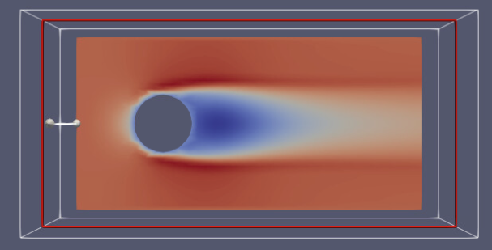

# cfd-verification-1

A simple incompressible flow around a sphere computational fluid dynamics model to be exercised with OpenFOAM version 11.  

*Work in progress.  Many parameters still need to be tuned.*

### Rough Workflow

0. Navigate to inside the `case_directory` folder.
1. `foamCleanCase` to remove all previous runs
2. `blockMesh` to create the initial block mesh
3. `snappyHexMesh` to create the refined mesh with the sphere obstruction
4. `foamRun` to run the simulation
5. `paraFoam -builtin` to view the results in ParaView

### Geometry and Initial Conditions

The boundary region is $\{ (x,y,z) : x \in [0,6], y \in [0,3], z \in [0,3]\}$.  Units are meters.  The sphere obstruction is centered at (1.5, 1.5, 1.5) with a radius of 0.5 meters.  

At all points on the the "inlet" patch the fluid velocity $U$ is $(7.5, 0, 0)$ (meters per second).  The inlet patch is the subset of points in the boundary region where $x=0$.  The flow is in the positive $x$ direction.  The boundary patches that are parallel to the flow also have a uniform fluid velocity of $(7.5, 0, 0)$ meters per second.  The "outlet" patch is the set of all points in the boundary region where $x=6$.  The gradient of velocity is zero at the outlet patch.  These are defined in the `case_directory/0/U` file.

The `animation.ogv` was created by slicing the 3D volume on the z-plane through the center of the sphere obstruction.

### License:

Copyright 2023 L3Harris Technologies, Inc.

Licensed under the Apache License, Version 2.0 (the "License"); you may not use this file except in compliance with the License. You may obtain a copy of the License at

http://www.apache.org/licenses/LICENSE-2.0

Unless required by applicable law or agreed to in writing, software distributed under the License is distributed on an "AS IS" BASIS, WITHOUT WARRANTIES OR CONDITIONS OF ANY KIND, either express or implied. See the License for the specific language governing permissions and limitations under the License.